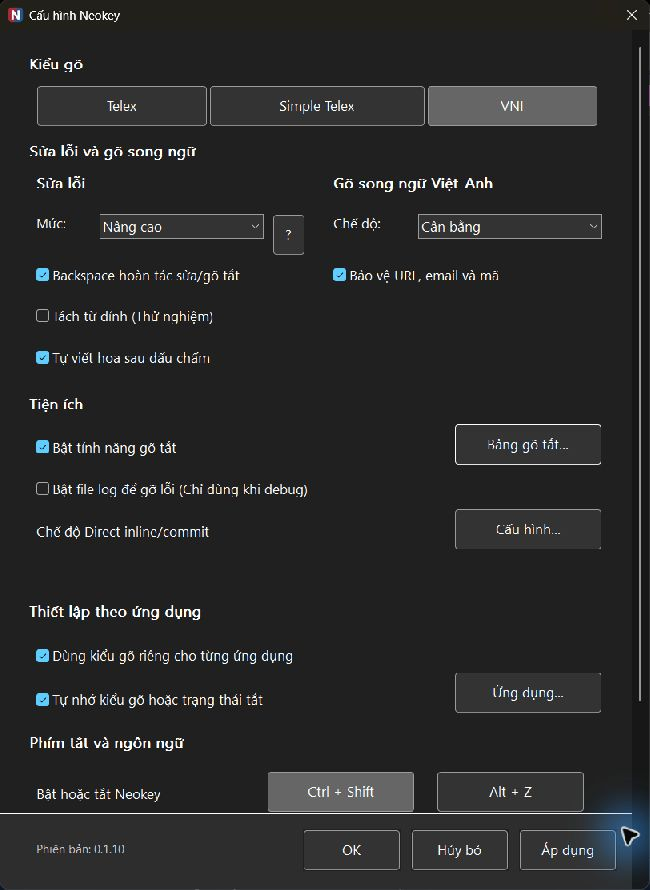
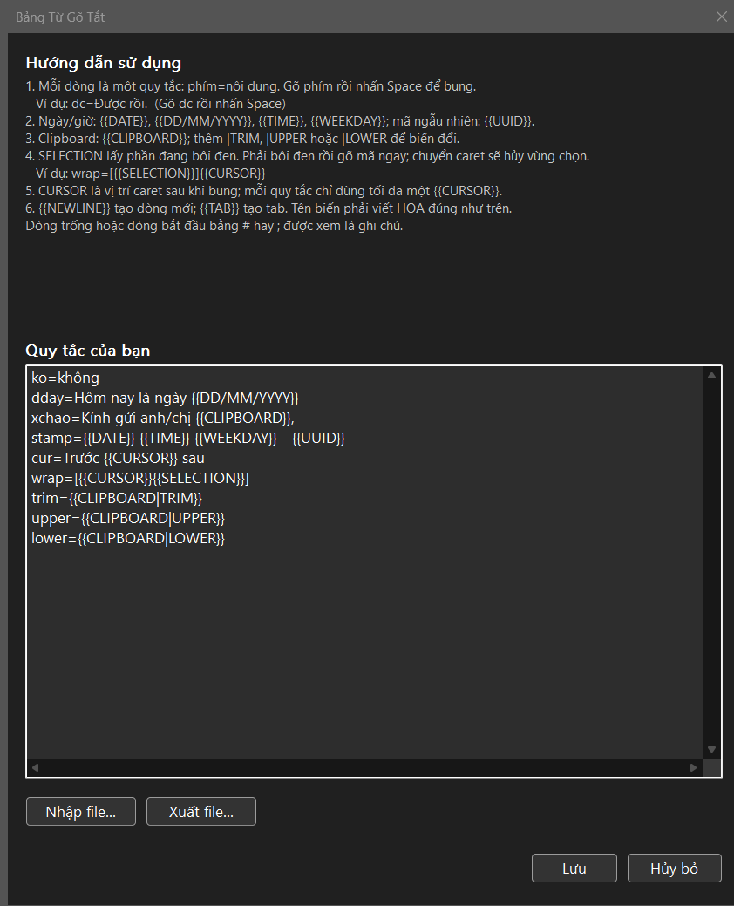

<p align="center">
  
</p>

<h1 align="center">Neokey</h1>

<p align="center"><a href="README.en.md">English</a></p>

<p align="center">
  <strong>Gõ tiếng Việt tự nhiên. Giữ nguyên tiếng Anh đúng lúc.</strong><br>
  Song ngữ thông minh · Gõ tắt linh hoạt · TSF native · Windows 10/11
</p>

<p align="center">
  <a href="https://github.com/hoanglinh221191/vietnamese-tsf-ime/releases/latest"><strong>Tải Neokey mới nhất</strong></a>
</p>

Neokey là bộ gõ tiếng Việt mã nguồn mở cho Windows. Bộ gõ sử dụng Windows Text
Services Framework (TSF) và hỗ trợ các kiểu gõ Telex, Telex đơn giản, và VNI
trong một IME Windows native. Hai điểm khác biệt nổi bật là khả năng gõ song
ngữ và gõ tắt linh hoạt: Neokey giữ nguyên từ tiếng Anh, URL, email và mã nguồn
ngay khi bạn vẫn đang ở chế độ gõ tiếng Việt, đồng thời biến một phím tắt thành
đoạn văn bản, mẫu điền hoặc snippet động.

## Gõ song ngữ Việt–Anh — không phải đổi qua lại

Trong chế độ **Tiếng Việt**, Neokey dùng từ điển hai tầng hơn 5.000 từ để nhận
diện từ tiếng Anh nhưng vẫn ưu tiên tạo đúng dấu tiếng Việt. Ví dụ đã được phủ
trong bộ kiểm thử:

> Gõ Telex `github vietes` → nhận `github viết`

- **Cân bằng** (mặc định): giữ các từ tiếng Anh thông dụng, phù hợp khi viết văn
  bản Việt–Anh hằng ngày.
- **Ưu tiên tiếng Anh**: mở rộng lớp từ vựng được bảo vệ, phù hợp với tài liệu kỹ
  thuật và nội dung có nhiều thuật ngữ tiếng Anh.
- **Tắt**: tắt riêng lớp nhận diện từ tiếng Anh khi bạn muốn ưu tiên hoàn toàn
  cho tiếng Việt.
- **Bảo vệ URL, email và mã**: giữ nguyên các chuỗi như `cmd.exe`,
  `name@example.com`, `CamelCase`, `sha256` hoặc `base64`.

<p align="center">
  
</p>

## Tính năng nổi bật

- Bộ gõ TSF native cho ứng dụng desktop Windows 64-bit và 32-bit.
- Hỗ trợ Telex, Telex đơn giản, và VNI.
- Các mức sửa lỗi có thể tùy chỉnh: Tắt, Thường, Nâng cao, và Thử nghiệm.
- Gõ song ngữ Việt–Anh với từ điển hai tầng 5.118 từ và ba mức bảo vệ.
- Gõ tắt động với ngày, giờ, UUID, clipboard, vùng chọn và vị trí con trỏ.
- Tự động tạm tắt chuyển đổi trong ô mật khẩu để không can thiệp vào dữ liệu
  nhạy cảm.
- Danh sách loại trừ ứng dụng, kèm tùy chọn tự động loại trừ ứng dụng khi
  chuyển sang tiếng Anh và tự khôi phục khi trở lại tiếng Việt.
- Ứng dụng cấu hình và khay hệ thống nhẹ (`neokey_config.exe`).
- Bộ cài Windows hỗ trợ cài mới, cập nhật tại chỗ và sửa chữa cài đặt.
- Gói portable kèm manifest SHA-256 để kiểm tra các tệp nhị phân phát hành.
- Gói ARM64 native riêng ở trạng thái **Preview** để thử nghiệm trên Windows ARM.

## Gõ tắt linh hoạt: tĩnh, động và theo ngữ cảnh

Mỗi quy tắc có dạng `phím=nội dung`; gõ phím rồi nhấn Space để bung. Ngoài nội
dung tĩnh, Neokey có thể chèn dữ liệu động, dùng nội dung đang copy hoặc đang
bôi đen, rồi đặt lại caret sau khi bung. Bảng gõ tắt hỗ trợ tối đa **4.096 quy
tắc** và tự nhận thay đổi sau khi lưu, không cần đóng/mở lại ứng dụng đang gõ.

| Quy tắc mẫu | Kết quả |
| --- | --- |
| `dday=Hôm nay là ngày {{DATE}}` | Chèn ngày hiện tại |
| `xchao=Kính gửi anh/chị {{CLIPBOARD}},` | Dùng nội dung clipboard |
| `wrap=[{{SELECTION}}]{{CURSOR}}` | Bọc phần đang chọn và đặt caret đúng vị trí |
| `stamp={{DATE}} {{TIME}} {{WEEKDAY}} - {{UUID}}` | Tạo mốc thời gian kèm mã UUID |

Các biến được hỗ trợ gồm `DATE`, `DD/MM/YYYY`, `TIME`, `WEEKDAY`, `UUID`,
`NEWLINE`, `TAB`, `CURSOR`, `CLIPBOARD` và `SELECTION`. Clipboard còn hỗ trợ
`TRIM`, `UPPER` và `LOWER`. Nếu kết quả vừa bung không như ý, Backspace có thể
hoàn tác về phím gõ tắt ban đầu trong các ngữ cảnh được hỗ trợ.

<p align="center">
  
</p>

## Cài đặt

Cách khuyên dùng là tải `NeokeySetup.exe` từ trang GitHub Releases.

1. Nhấn đúp `NeokeySetup.exe`. Không cần chọn **Run as administrator**; bộ cài
   sẽ tự yêu cầu quyền khi cần.
2. Chấp nhận yêu cầu quyền Quản trị viên của Windows và chọn **Cài đặt**.
3. Neokey được thêm vào Windows, đặt làm bộ gõ mặc định và mở ứng dụng cấu
   hình sau khi hoàn tất.

> [!IMPORTANT]
> Sau khi cài đặt hoặc cập nhật, hãy đóng và mở lại mọi ứng dụng đang chạy để
> chúng nạp bộ gõ mới. Nên khởi động lại Windows để dịch vụ nhập liệu được nạp
> lại đầy đủ, đặc biệt khi Neokey chưa xuất hiện hoặc ứng dụng vẫn dùng bản cũ.

Để cập nhật, chỉ cần chạy `NeokeySetup.exe` của bản mới. Bộ cài tự nhận biết
phiên bản đang có, hiện nút **Cập nhật**, giữ nguyên cấu hình và dữ liệu gõ tắt.
Chạy lại cùng phiên bản sẽ chuyển sang chế độ sửa chữa; cài đè bản cũ hơn bị
chặn.

### Bản portable

Người dùng cần bản portable có thể tải `Neokey-portable.zip`, giải nén vào một
vị trí cố định như `C:\Neokey`, rồi chạy `install.bat`. Không di chuyển thư mục
sau khi đăng ký vì Windows lưu đường dẫn tuyệt đối của DLL. Script vẫn kiểm tra
manifest và đặt Neokey làm bộ gõ mặc định.

Sau khi chạy `install.bat`, hãy đóng và mở lại các ứng dụng đang chạy, rồi khởi
động lại Windows để bảo đảm chúng nạp Neokey từ gói portable mới.

Hướng dẫn portable đầy đủ bằng tiếng Việt nằm tại
[PORTABLE_README.vi.md](PORTABLE_README.vi.md). Bản tiếng Anh nằm tại
[PORTABLE_README.md](PORTABLE_README.md).

## Bảo vệ mật khẩu và điều khiển ứng dụng

Khi Windows đánh dấu ô nhập hiện tại là mật khẩu, Neokey tự bỏ qua chuyển đổi
tiếng Việt để nội dung nhạy cảm được nhập nguyên trạng.

Trong `neokey_config.exe`, bạn có thể chặn Neokey trong từng ứng dụng bằng tên
tiến trình. Tùy chọn **Tự động loại trừ app khi chuyển sang tiếng Anh** sẽ tạm
thêm ứng dụng đang dùng vào danh sách chặn khi bạn chuyển sang tiếng Anh, rồi
chỉ gỡ mục do tính năng này thêm khi quay lại tiếng Việt. Những ứng dụng bạn tự
chặn vẫn được giữ nguyên.

## Kiểm tra hoặc gỡ cài đặt

Với bản Setup, gỡ Neokey từ **Settings > Apps > Installed apps > Neokey**.

Từ thư mục portable, kiểm tra trạng thái cài đặt bằng lệnh:

```powershell
powershell -NoProfile -ExecutionPolicy Bypass -File .\register.ps1 -Status
```

Để gỡ Neokey, chạy `uninstall.bat` trong đúng thư mục đã dùng để cài đặt.

## Build từ mã nguồn

Bản build phát hành cần Microsoft Visual C++ Build Tools và Windows SDK. Từ
thư mục gốc của repository, chạy:

```bat
build.bat
build\cxx23\core_tests.exe
package.bat -Zip -Installer
```

Thư mục portable được tạo tại `dist\Neokey`; các tệp phát hành là
`dist\Neokey-portable.zip` và `dist\NeokeySetup.exe`. Tạo installer cần Inno
Setup 6 hoặc 7. Hãy chỉ phân phối artifact trong `dist`, không sao chép riêng lẻ
tệp từ `build`.

## Về `neokey_config.exe`

`neokey_config.exe` là ứng dụng cấu hình và khay hệ thống riêng biệt. Bộ máy
gõ thực sự là các TSF DLL được Windows đăng ký, vì vậy Neokey vẫn gõ được khi
cửa sổ cấu hình đã đóng. Hãy mở ứng dụng này khi cần thay đổi kiểu gõ, mức sửa
lỗi, gõ tắt, khởi động cùng Windows, hoặc danh sách ứng dụng chặn.

## Lưu ý cho terminal

Neokey mặc định bỏ qua các terminal thông dụng để giữ nguyên việc nhập lệnh,
gợi ý, và trình soạn thảo terminal. Để bật Neokey trong terminal, dùng
`neokey_config.exe` để sửa danh sách ứng dụng chặn.

## Giấy phép

Neokey được phát hành theo [giấy phép MIT](LICENSE). Dữ liệu từ điển song ngữ
đi kèm được ghi công riêng trong [thông báo bên thứ ba](THIRD_PARTY_NOTICES.md).
